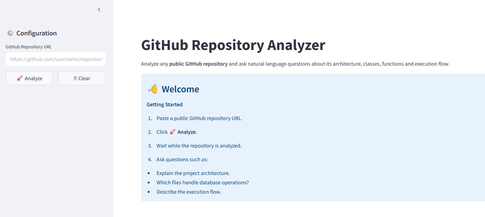

# 🤖 GitHub Repository Analyzer

A Retrieval-Augmented Generation (RAG) application that analyzes any public GitHub repository and answers natural language questions about its codebase, architecture, APIs, execution flow, authentication, and database interactions.

## 🚀 Features

* Analyze any public GitHub repository via URL
* Automatic repository cloning and indexing
* Semantic code chunking with vector embeddings
* In-memory ChromaDB vector storage
* Natural language Q&A powered by Groq LLM

### Supported Analysis

* Project architecture
* Folder structure
* Execution flow
* API routes and endpoints
* Authentication mechanisms
* Database interactions
* Socket communication
* Frontend–backend integration

---

## 🛠️ Tech Stack

| Component       | Technology                                 |
| --------------- | ------------------------------------------ |
| Frontend        | Streamlit                                  |
| LLM             | Groq (Llama 3.3 70B Versatile)             |
| Embeddings      | Gemini Embeddings (`gemini-embedding-001`) |
| Vector Database | ChromaDB                                   |
| Framework       | LangChain                                  |
| Git Operations  | GitPython                                  |

---

## 📂 Project Structure

```text
github_repo_analyzer/
├── app.py
├── repo_analyzer.py
├── github_utils.py
├── requirements.txt
├── .env
└── README.md
```

---

## ⚙️ Installation

Install dependencies:

```bash
pip install -r requirements.txt
```

Create a `.env` file:

```env
GROQ_API_KEY=your_groq_api_key
GOOGLE_API_KEY=your_google_api_key
```

---

## ▶️ Run

```bash
streamlit run app.py
```

---

## 💡 Usage

1. Enter a public GitHub repository URL.
2. Click **Analyze**.
3. Wait for indexing to complete.
4. Ask questions about the repository.

### Example Queries

* Explain the project architecture.
* Describe the execution flow.
* How does authentication work?
* Which files handle API routes?
* Explain the database schema.
* How do the frontend and backend communicate?

---

## 📌 Example Repository

```text
https://github.com/username/repository
```

---

## 🖼️ Demo


